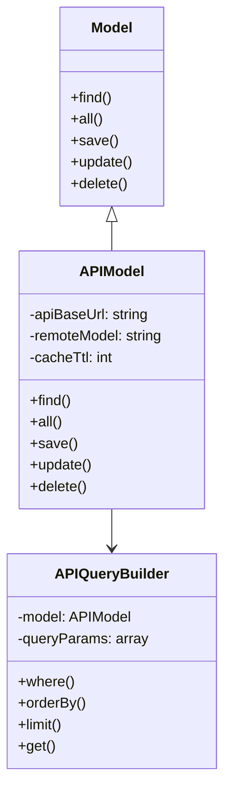

# Design Patterns

This project uses several design patterns which are explained below.

## Adapter Pattern

This pattern is used to convert the Eloquent Model interface to API interface. The `APIModel` class acts as an Adapter and converts Eloquent requests to API requests.

### Example:

```php
// Eloquent Model
$user = User::find(1);

// API Model
$user = APIModel::find(1); // Convert to API request
```

## Builder Pattern

This pattern is used to build API queries. The `APIQueryBuilder` class acts as a Builder and provides the ability to build complex queries in a chainable manner.

### Example:

```php
$users = User::where('name', 'like', '%John%')
    ->orderBy('created_at', 'desc')
    ->limit(10)
    ->get();
```

## Proxy Pattern

This pattern is used to improve performance and reduce API requests. The `APIModel` class uses cache as a Proxy to prevent repetitive requests to the API.

### Example:

```php
// First request to API
$user = User::find(1);

// Subsequent requests are read from cache
$user = User::find(1); // From cache
```

## UML Diagram



## Pipeline Pattern

This pattern is used to orchestrate operations that span multiple services, particularly for operations that cover multiple panels and have different database connections.

### Structure:

```
Modules/PipLines/Common/
├── {PipelineName}Pipeline.php
└── ...
```

### Example:

```php
<?php

namespace FlowServices\Common;

use Modules\Basic\BaseKit\BaseService;

class UserRegistrationPipeline extends BaseService
{
    public static function send(array $services, array $data): self
    {
        $pipeline = new static();
        return $pipeline->handle($services, $data);
    }
    
    public function handle(array $services, array $data): self
    {
        DB::beginTransaction();
        try {
            // Execute various operations
            $result = $services['userService']->actCreate($data);
            if ($result->hasErrors()) {
                $this->setErrors($result->getErrors());
                throw new \Exception('User creation failed');
            }
            
            $result = $services['notificationService']->actSendWelcome($data['email']);
            if ($result->hasErrors()) {
                $this->setErrors($result->getErrors());
                throw new \Exception('Notification sending failed');
            }
            
            DB::commit();
            $this->setSuccessResponse(['data' => $data]);
        } catch (\Exception $e) {
            DB::rollBack();
            $this->addError([], $e->getMessage());
        }
        return $this;
    }
}
```

## Further Resources

- [Adapter Pattern](https://refactoring.guru/design-patterns/adapter)
- [Builder Pattern](https://refactoring.guru/design-patterns/builder)
- [Proxy Pattern](https://refactoring.guru/design-patterns/proxy)
- [Pipeline Pattern](https://refactoring.guru/design-patterns/chain-of-responsibility)
