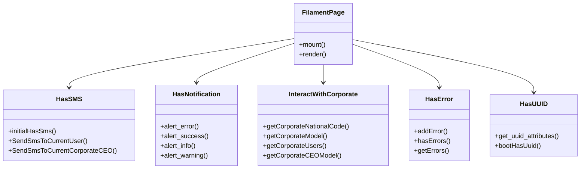

# Filament Traits and Concerns

This documentation includes all Traits and Concerns available in the Filament project, designed to improve performance and reusability.

## Table of Contents

- [HasSMS](#hassms)
- [HasNotification](#hasnotification)
- [InteractWithBusinessSupport](#interactwithbusinesssupport)
- [InteractWithCorporate](#interactwithcorporate)
- [InteractWithManagers](#interactwithmanagers)
- [CheckPageStandards](#checkpagestandards)
- [InteractWithLog](#interactwithlog)
- [RetrieveFilamentProviderTrait](#retrievefilamentprovidertrait)
- [HasUUID](#hasuuid)
- [HasError](#haserror)
- [HasAttributeLabels](#hasattributelabels)

## HasSMS

This trait is used for sending SMS in Filament.

### Features

- Send SMS to current user
- Send SMS to corporate CEO
- Use `BaseSmsService` for SMS sending

### Usage

```php
use Units\SMS\Common\Concerns\HasSMS;

class MyFilamentPage extends Page
{
    use HasSMS;
    
    public function mount()
    {
        $this->initialHasSms();
    }
    
    public function sendNotification()
    {
        $this->SendSmsToCurrentUser('Your message has been received');
        $this->SendSmsToCurrentCorporateCEO('New request submitted');
    }
}
```

### Methods

#### `initialHasSms()`
Initial method for SMS service setup

#### `SendSmsToCurrentUser($text)`
Send SMS to currently logged-in user in the current panel

#### `SendSmsToCurrentCorporateCEO($text)`
Send SMS to corporate CEO

## HasNotification

This trait is used for displaying notifications in Filament.

### Features

- Display different notifications (error, success, info, warning)
- Use Filament Notification API
- Generate unique ID for each notification

### Usage

```php
use Modules\Basic\BaseKit\Filament\HasNotification;

class MyFilamentPage extends Page
{
    use HasNotification;
    
    public function showNotifications()
    {
        $this->alert_success('Operation completed successfully');
        $this->alert_error('Error in operation');
        $this->alert_info('Important information');
        $this->alert_warning('Warning');
    }
}
```

### Methods

#### `alert_error($message, $title = '')`
Display error notification

#### `alert_success($message, $title = '')`
Display success notification

#### `alert_info($message, $title = '')`
Display info notification

#### `alert_warning($message, $title = '')`
Display warning notification

## InteractWithBusinessSupport

This trait is used for interacting with business support.

### Features

- Send SMS to support
- Send warning notification to support
- Send notification to latest active support

### Usage

```php
use Modules\Basic\BaseKit\Filament\InteractWithBusinessSupport;

class MyFilamentPage extends Page
{
    use InteractWithBusinessSupport;
    
    public function notifySupport()
    {
        $this->sendSmsToBusinessSupport('New issue reported');
        $this->sendWaringNotificationToBusinessSupport('System warning');
        $this->sendWarningNotificationToLatestActiveBusinessSupport('Urgent warning');
    }
}
```

## InteractWithCorporate

This trait is used for interacting with corporations.

### Features

- Get corporate national code
- Get corporate model
- Get corporate users
- Get corporate CEO model

### Usage

```php
use Modules\Basic\BaseKit\Filament\InteractWithCorporate;

class MyFilamentPage extends Page
{
    use InteractWithCorporate;
    
    public function getCorporateInfo()
    {
        $nationalCode = $this->getCorporateNationalCode();
        $corporate = $this->getCorporateModel();
        $users = $this->getCorporateUsers('ceo');
        $ceo = $this->getCorporateCEOModel();
    }
}
```

### Methods

#### `getCorporateNationalCode()`
Get corporate national code from session

#### `getCorporateModel()`
Get corporate model based on national code

#### `getCorporateUsers($role = null)`
Get corporate users with or without role filter

#### `getCorporateCEOModel()`
Get corporate CEO model

## InteractWithManagers

This trait is used for interacting with managers.

### Features

- Get latest active user
- Use ActLog for activity tracking

### Usage

```php
use Modules\Basic\BaseKit\Filament\InteractWithManagers;

class MyFilamentPage extends Page
{
    use InteractWithManagers;
    
    public function getLatestActivity()
    {
        $latestUser = $this->getLatestActiveUser();
    }
}
```

## CheckPageStandards

This trait is used for checking development standards.

### Features

- Check class comment standards
- Check for Figma link in comment
- Active only in debug mode

### Usage

```php
use Modules\Basic\BaseKit\Filament\Concerns\CheckPageStandards;

/**
 * @url https://www.figma.com/file/example
 */
class MyFilamentPage extends Page
{
    use CheckPageStandards;
    
    public function mount()
    {
        $this->checkDevelopentStandards();
    }
}
```

## InteractWithLog

This trait is used for interacting with the logging system.

### Features

- Log different messages (info, error, warning)
- Use Laravel Log Facade

### Usage

```php
use Modules\Basic\Concerns\InteractWithLog;

class MyService
{
    use InteractWithLog;
    
    public function processData()
    {
        $this->logInfo('Starting data processing');
        $this->logError('Processing error');
        $this->logWarning('System warning');
    }
}
```

## RetrieveFilamentProviderTrait

This trait is used for automatic registration of Filament resources.

### Features

- Automatic registration of views, components, translations
- Registration of configs and commands
- Asset publishing
- Multi-panel support

### Usage

```php
use Modules\Basic\Concerns\RetrieveFilamentProviderTrait;

class MyServiceProvider extends ServiceProvider
{
    use RetrieveFilamentProviderTrait;
    
    public function boot()
    {
        $this->registerFilamentPanel('Admin');
        $this->registerFilamentPanel('My');
    }
}
```

### Methods

#### `registerFilamentPanel($panelDirectoryName)`
Register all resources of a Filament panel

## HasUUID

This trait is used for automatic UUID generation.

### Features

- Automatic UUID generation for specified fields
- Configurable for different fields
- Use Laravel Str::uuid()

### Usage

```php
use Modules\Basic\Concerns\HasUUID;

class MyModel extends Model
{
    use HasUUID;
    
    protected static function get_uuid_attributes(): array
    {
        return ['id', 'reference_id'];
    }
}
```

## HasError

This trait is used for error management.

### Features

- Store errors in array
- Log errors
- Check for errors
- Model error management

### Usage

```php
use Modules\Basic\Concerns\HasError;

class MyService
{
    use HasError;
    
    public function process()
    {
        if ($error) {
            $this->addError(['field' => 'name'], 'Name is required');
        }
        
        if ($this->hasErrors()) {
            return false;
        }
    }
}
```

### Methods

#### `addError($data, $message)`
Add error to error list

#### `hasErrors()`
Check for errors

#### `getErrors()`
Get all errors

#### `handleModelErrors($model)`
Handle model errors

## HasAttributeLabels

This trait is used for field label management.

### Features

- Define custom labels for fields
- Define hints for fields
- Localization support

### Usage

```php
use Modules\Basic\Concerns\HasAttributeLabels;

class MyModel extends Model
{
    use HasAttributeLabels;
    
    protected function attributeLabels(): array
    {
        return [
            'name' => 'Name',
            'email' => 'Email',
            'phone' => 'Phone'
        ];
    }
    
    protected function attributeHints(): array
    {
        return [
            'email' => 'Enter valid email',
            'phone' => '11-digit phone number'
        ];
    }
}
```

### Methods

#### `getAttributeLabel($attribute)`
Get label of a field

#### `getAttributeHint($attribute)`
Get hint of a field

## UML Diagram



## Best Practices

1. **Use Traits**: Always use appropriate traits for desired functionality
2. **Error Management**: Use `HasError` for error management
3. **Logging**: Use `InteractWithLog` for logging activities
4. **Standards**: Use `CheckPageStandards` to ensure standards compliance
5. **UUID**: Use `HasUUID` for key fields

## Further Resources

- [Filament Documentation](https://filamentphp.com/docs)
- [Laravel Traits](https://laravel.com/docs/eloquent#traits)
- [Design Patterns](https://refactoring.guru/design-patterns)
