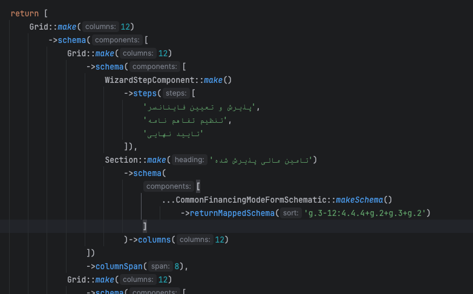
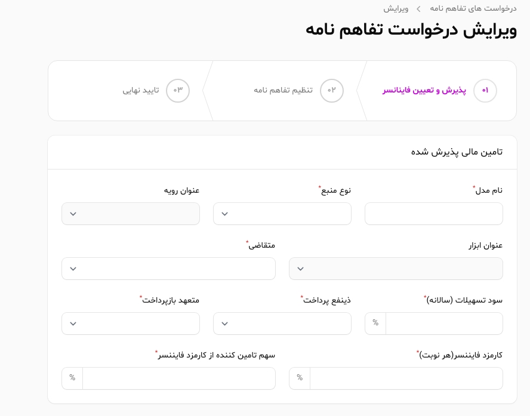

# Schematic Pattern Documentation

## Overview

The Schematic pattern is a custom implementation that provides a structured approach to defining Filament 3 form and table schemas. This pattern allows for better code organization, reusability, and maintainability by separating schema definitions from resource classes.

## Architecture

### Directory Structure

```
Modules/Units/{Unit}/
├── Common/
│   └── Filament/
│       └── Schemtics/
│           └── {Context}/
│               ├── CommonTableSchematic.php
│               └── CommonFormSchematic.php
└── {Panel}/
    └── Filament/
        └── {Context}/
            └── Schematic/
                ├── {Unit}{Context}TableSchema.php
                └── {Unit}{Context}FormSchema.php

```

### Base Classes

The pattern is built on two base classes:

- **`BaseTableSchematic`**: Extends `Schematic` and implements `FilamentTableSchemaContract`
- **`BaseFormSchematic`**: Extends `Schematic` and implements `FilamentFormSchemaContract`

## Implementation Pattern

### 1. Common Schematic Classes

Create base schematic classes in the `Common` directory that define the core schema structure:

```php
<?php
namespace Units\FinanceRequest\Common\Filament\Schemtics\Initial;

use Modules\Basic\BaseKit\Filament\Schematics\BaseTableSchematic;
use Filament\Tables\Table;

class CommonTableSchematic extends BaseTableSchematic
{
    function tableSchema(Table $table): Table
    {
        return $table
            ->columns([
                $this->textColumn('code'),
                $this->moneyColumn('amount'),
                $this->badgeColumn('status'),
                // ... other columns
            ]);
    }

    public function getActions(): array
    {
        return [
            // Define common actions
        ];
    }

    public function attributeLabels(): array
    {
        return [
            'code' => '#',
            'amount' => 'ارزش منابع',
            'status' => 'وضعیت',
        ];
    }
}
```

### 2. Panel-Specific Schematic Classes

Create panel-specific schematics that extend the common classes:

```php
<?php
namespace Units\FinanceRequest\Manage\Filament\Initial\Schematic;

use Units\FinanceRequest\Common\Filament\Schemtics\Initial\CommonTableSchematic;

class FinanceRequestInitTableSchema extends CommonTableSchematic
{
    function tableSchema(Table $table): Table
    {
        return $table
            ->query(
                FinanceRequestModel::query()
                    ->whereIn('status', [
                        FinanceRequestStatusesEnum::MY_INIT_SENT,
                        FinanceRequestStatusesEnum::MANAGE_INIT_APPROVED,
                        // ... other statuses
                    ])
            )
            ->columns([
                // Override or extend columns as needed
            ]);
    }

    public function getActions(): array
    {
        return [
            // Panel-specific actions
        ];
    }
}
```

## Usage in Resources

### Table Usage

```php
<?php
namespace Units\FinanceRequest\Manage\Filament\Initial\Resources;

use Filament\Resources\Resource;use Filament\Tables\Table;use Units\FinanceRequest\Manage\Filament\Schematic\ManageFinanceRequestTableSchema;

class FinanceRequestResource extends Resource
{
    public static function table(Table $table): Table
    {
        return ManageFinanceRequestTableSchema::makeTable($table)
            ->returnTable();
    }
}
```

### Form Usage

```php
<?php
namespace Units\FinanceRequest\Manage\Filament\Initial\Resources\FinanceRequestResource\Pages;

use Filament\Forms\Form;
use Filament\Resources\Pages\EditRecord;
use Units\FinanceRequest\Manage\Filament\Initial\Schematic\FinanceRequestInitFormSchema;

class EditFinanceRequest extends EditRecord
{
    public function form(Form $form): Form
    {
        return FinanceRequestInitFormSchema::makeForm($form, 'edit')
            ->returnEditForm();
    }
}
```

## Key Features

### 1. Schema Reusability

Common schematics can be reused across different panels with specific customizations:

```php
// Common form schema
class CommonFormSchematic extends BaseFormSchematic
{
    function commonFormSchema(): array
    {
        return [
            Grid::make(4)->schema([
                $this->moneyInput('amount'),
                $this->textInput('repayment_period'),
                // ... other fields
            ])
        ];
    }
}

// Panel-specific form schema
class MyFormSchematic extends CommonFormSchematic
{
    // Inherits all common functionality
    // Can override specific methods if needed
}
```

### 2. Dynamic Schema Manipulation

Schematics provide methods for dynamic schema manipulation:

```php
$schema = CommonFormSchematic::makeSchema()
    ->invisibleAllAttributes()
    ->visibleAttribute('amount')
    ->visibleAttribute('repayment_period')
    ->disableAllAttributes()
    ->returnMappedSchema('g.3+g.3+g.3+g.1');
```

### Pattern Syntax Reference

The `returnMappedSchema()` method accepts a compact pattern language that maps visible attributes into Filament containers and grids. Patterns are read left-to-right and consume attributes in order.

#### Tokens

- **`g` (Grid)**
  - `g.N`
    - Consumes N attributes and places them in a `Grid::make(N)`.
    - Example: `g.3` → `Grid::make(3)->schema([$a0,$a1,$a2])`.
  - `g.N-M:s1.s2...sN`
    - Extended grid with explicit column span mapping.
    - Consumes N attributes, creates `Grid::make(M)`, and applies `columnSpan(si)` to the i-th attribute.
    - Validation: count(spans) must equal N, and sum(spans) must equal M.
    - Examples:
      - `g.3-12:4.4.4` → `Grid::make(12)` with spans `[4,4,4]` on the three items.
      - `g.4-12:3.3.3.3` → spans `[3,3,3,3]`.
      - `g.3-12:6.2.4` → spans `[6,2,4]`.

- **`c` (Card)**
  - `c`
    - Wraps all remaining (visible) attributes in a `Card`.
  - `c>K`
    - Consumes exactly K attributes and wraps them in a `Card`.

- **`s` (Section)**
  - `s`
    - Wraps all remaining attributes in a `Section`.
  - `s>K`
    - Consumes exactly K attributes and wraps them in a `Section`.

#### Operators

- **`+` (nesting)**
  - Implicit nesting. When the first token is a container (`c` or `s`), it wraps the following components as its children.
  - Examples:
    - `c+g.3` → `Card` containing one `Grid(3)`.
    - `s+g.2+g.1` → `Section` containing `Grid(2)` and `Grid(1)`.

- **`,` (siblings)**
  - Separates siblings at the same level. Returns multiple components side-by-side in the resulting schema array.
  - Example: `g.2, g.1` → two grids as siblings: `[Grid(2), Grid(1)]`.

- **`()` (grouping)**
  - Groups tokens to control how `+` and `,` are applied.
  - Example: `c+(g.2, g.1)` → a `Card` containing two sibling grids.

#### Combined Examples

```php
// Four grids wrapped in a Card
returnMappedSchema('c+g.3+g.3+g.3+g.1');

// Section with two sibling grids
returnMappedSchema('s+g.2+g.1');

// Standalone siblings (no outer container)
returnMappedSchema('g.2, g.1, g.1');

// Grid with explicit spans (sum must match total columns)
returnMappedSchema('g.3-12:4.4.4');
returnMappedSchema('g.4-12:3.3.3.3');
returnMappedSchema('g.3-12:6.2.4');

// Container consuming a fixed number of attributes
returnMappedSchema('c>2+g.2');
returnMappedSchema('s>3');
```
##### Another sample
Code:


Result:


#### Notes and Validation

- Unknown tokens or malformed patterns throw descriptive exceptions.
- `g.N` and `c>K`/`s>K` will fail if there are not enough attributes to consume.
- For `g.N-M:spans`, the number of spans must be N and their sum must equal M.

### 3. Attribute Management

Schematics provide comprehensive attribute management:

```php
public function attributeLabels(): array
{
    return [
        'amount' => 'ارزش منابع مورد نیاز',
        'repayment_period' => 'دوره بازپرداخت درخواستی',
    ];
}

public function invisibleAttributes(): array
{
    return ['internal_field'];
}

public function disableAttributes(): array
{
    return ['readonly_field'];
}
```

## Best Practices

### 1. Naming Conventions

- **Common schematics**: `Common{Type}Schematic.php`
- **Panel schematics**: `{Unit}{Context}{Type}Schema.php`
- **Namespaces**: Follow the directory structure exactly

### 2. Schema Organization

- Keep common schematics in `Common/Filament/Schemtics/{Context}/`
- Keep panel-specific schematics in `{Panel}/Filament/{Context}/Schematic/`
- Use descriptive context names (e.g., `Initial`, `Operational`, `Managerial`)

### 3. Method Implementation

Always implement required methods:

```php
// For Table Schematics
function tableSchema(Table $table): Table
public function getActions(): array
public function attributeLabels(): array
public function invisibleAttributes(): array
public function disableAttributes(): array

// For Form Schematics
function commonFormSchema(): array
function editFormSchema(): array|null
function createFormSchema(): array|null
public function attributeLabels(): array
public function attributeHints(): array
public function attributePlaceholders(): array
public function attributeDefaults(): array
```

### 4. Query Optimization

Use specific queries in panel schematics:

```php
function tableSchema(Table $table): Table
{
    return $table
        ->query(
            FinanceRequestModel::query()
                ->whereIn('status', [
                    FinanceRequestStatusesEnum::MY_INIT_SENT,
                    FinanceRequestStatusesEnum::MANAGE_INIT_APPROVED,
                ])
        )
        ->columns([
            // ... columns
        ]);
}
```

## Advanced Features

### 1. Schema Composition

Combine multiple schematics:

```php
function commonFormSchema(): array
{
    return [
        Card::make()->schema([
            // Main form fields
            ...CommonFinancingModeFormSchematic::makeSchema()
                ->invisibleAllAttributes()
                ->visibleAttribute('annual_loan_interest')
                ->visibleAttribute('loan_recipient')
                ->returnMappedSchema('g.3+g.3+g.3+g.1')
        ])
    ];
}
```

### 2. Conditional Schema

Implement conditional logic based on record state:

```php
public function getActions(): array
{
    return [
        Action::make('edit')
            ->visible(fn($record) => in_array($record->status, [
                FinanceRequestStatusesEnum::MY_DRAFT->value,
                FinanceRequestStatusesEnum::MY_INIT_SENT->value
            ])),
    ];
}
```

### 3. Schema Mapping

Use pattern-based schema mapping:

```php
// Grid layout: 3 columns + 3 columns + 3 columns + 1 column
$schema->returnMappedSchema('g.3+g.3+g.3+g.1')

// Card layout
$schema->returnMappedSchema('c')

// Section layout  
$schema->returnMappedSchema('s')
```

## Migration from Filament 4 Style

This pattern provides Filament 4-like functionality in Filament 3:

### Before (Filament 3 Direct)
```php
public static function table(Table $table): Table
{
    return $table
        ->columns([
            TextColumn::make('code'),
            MoneyColumn::make('amount'),
            // ... many more columns
        ])
        ->actions([
            // ... actions
        ]);
}
```

### After (Schematic Pattern)
```php
public static function table(Table $table): Table
{
    return FinanceRequestInitTableSchema::makeTable($table)
        ->returnTable();
}
```

## Benefits

1. **Maintainability**: Schema logic is separated from resource classes
2. **Reusability**: Common schematics can be shared across panels
3. **Consistency**: Standardized approach to form and table definitions
4. **Flexibility**: Easy to customize schemas for different contexts
5. **Type Safety**: Better IDE support and error detection
6. **Testing**: Easier to unit test schema logic independently

## Related Documentation

- [Design Patterns](./design-patterns.md)
- [DTO Pattern](./dto.md)
- [API Documentation](./api.md)
- [Filament Panel Registration](./filament-panel-registration.md)

---

*This documentation covers the Schematic pattern implementation for Filament 3, providing a structured approach to form and table schema management.*
